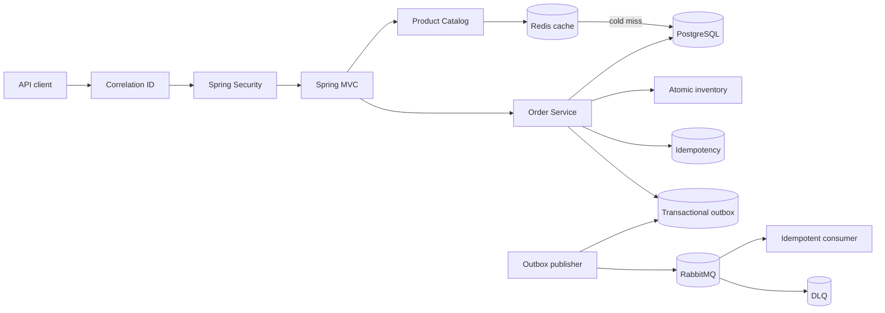

# Spring Boot Rescue Lab

[](https://github.com/tawsif113/spring-boot-rescue-lab/actions/workflows/ci.yml)


[](LICENSE)

**A production-incident portfolio for Spring Boot backend engineering.**

Instead of another CRUD demo, this repository starts with a deliberately fragile order API and repairs six production-style failures with reproducible evidence, PostgreSQL/Testcontainers regression tests, architecture decisions, and CI artifacts.

> **Portfolio focus:** performance, idempotency, concurrency, authorization, reliable messaging, caching, and operability. All incidents are simulations; no employer or client source code is used.

## 30-second recruiter scan

| Incident | Failure mode | Engineering fix | Verified outcome |
|---|---|---|---|
| [INC-001](incidents/INC-001-slow-order-search.md) | N+1 order search | Pagination-safe two-phase fetch + index | **42+ SQL statements → exactly 3** for a 20-order page |
| [INC-002](incidents/INC-002-duplicate-orders.md) | Retry-created duplicate orders | Persistent idempotency + SHA-256 fingerprint + advisory lock | **8 concurrent retries → 1 order / 1 stock reservation** |
| [INC-003](incidents/INC-003-inventory-race.md) | Overselling the final unit | Atomic conditional stock update | **2 buyers / 1 unit → 1 success + 1 rejection** |
| [INC-004](incidents/INC-004-broken-authorization.md) | Broken object-level authorization | Principal-derived identity + ownership-scoped queries | Cross-customer access blocked; admin/customer boundaries tested |
| [INC-005](incidents/INC-005-lost-events.md) | DB commit + message publish inconsistency | Transactional outbox + confirms + retries + DLQ + dedup | Committed orders retain durable event intent; duplicates are safe |
| [INC-006](incidents/INC-006-cache-stampede.md) | Hot-key cache stampede | Redis distributed single-flight + TTL jitter + after-commit invalidation | **24 concurrent cold reads → exactly 1 PostgreSQL load** |

### What this demonstrates

- Evidence-driven SQL and performance debugging rather than speculative optimization.
- Correct retry semantics and concurrency control under contention.
- Authorization enforced below the controller through ownership-aware database queries.
- An explicit **at-least-once** messaging model instead of pretending PostgreSQL + RabbitMQ can provide exactly-once delivery.
- Distributed cache coordination with Redis, bounded waiting, TTL jitter, transaction-safe invalidation, and fail-open behavior.
- Production-oriented observability: correlation IDs, ECS JSON logs, health probes, Prometheus metrics, and Grafana.
- Verification with Java 25 CI, JUnit 5, PostgreSQL Testcontainers, Flyway, and reproducible evidence artifacts.

## System at a glance



**Fast paths:** [Portfolio case study](docs/PORTFOLIO-CASE-STUDY.md) · [Architecture](docs/ARCHITECTURE.md) · [Production checklist](docs/PRODUCTION-CHECKLIST.md) · [3-minute demo script](docs/DEMO-SCRIPT.md) · [Postman collection](postman/Spring-Boot-Rescue-Lab.postman_collection.json)

## Project status

**Milestone 7 — Complete.** The deliberately fragile starting point is preserved at [`baseline-fragile-v0.1.0`](https://github.com/tawsif113/spring-boot-rescue-lab/tree/baseline-fragile-v0.1.0), while `main` contains all six remediations plus the final operability/portfolio release.
## Technology

`Java 25` · `Spring Boot 4.1.1` · `Spring Security` · `JPA/Hibernate` · `PostgreSQL 17` · `Flyway` · `RabbitMQ 4` · `Redis` · `Micrometer/Prometheus` · `Testcontainers` · `Docker Compose` · `GitHub Actions`

The default project target is Java 25. Contributors temporarily limited to JDK 17 can run verification with `-PjavaVersion=17`.

### Architecture deep dive

The service is intentionally a modular monolith so each failure can be isolated and measured without distributed-system boilerplate. The full runtime, transaction, security, health, and messaging views are documented in [`docs/ARCHITECTURE.md`](docs/ARCHITECTURE.md).
## Run locally

Prerequisites:

- JDK 25
- Docker with the Compose plugin

Start the infrastructure:

```bash
docker compose up -d
```

Run the application:

```bash
./gradlew bootRun
```

Check its health:

```bash
curl http://localhost:8080/actuator/health
```

RabbitMQ Management is available at <http://localhost:15672> with the local credentials `rescue_lab` / `rescue_lab`.

Useful local endpoints:

| Purpose | Endpoint | Access |
|---|---|---|
| Health | `/actuator/health` | Public |
| Liveness | `/actuator/health/liveness` | Public |
| Readiness | `/actuator/health/readiness` | Public |
| Swagger UI | `/swagger-ui.html` | Public in this lab |
| OpenAPI JSON | `/v3/api-docs` | Public in this lab |
| Prometheus | `/actuator/prometheus` | Admin |

Readiness includes PostgreSQL but intentionally excludes RabbitMQ and Redis. Broker outages accumulate durable outbox work, while Redis outages degrade catalog performance to PostgreSQL rather than making the API unavailable.

## Try the API

The local-only demo identities are:

| Username | Default password | Role |
|---|---|---|
| `alice` | `alice-change-me` | Customer |
| `bob` | `bob-change-me` | Customer |
| `admin` | `admin-change-me` | Administrator |

Override them with `ALICE_PASSWORD`, `BOB_PASSWORD`, and `ADMIN_PASSWORD`. Use TLS and an external OIDC/OAuth2 provider in production.

Create a product:

```bash
curl -i -X POST http://localhost:8080/api/admin/products \
  -u admin:admin-change-me \
  -H 'Content-Type: application/json' \
  -d '{
    "sku": "KEYBOARD-01",
    "name": "Mechanical Keyboard",
    "unitPrice": 80.00,
    "availableStock": 10
  }'
```

Copy the returned product ID and create an order:

```bash
curl -i -X POST http://localhost:8080/api/orders \
  -u alice:alice-change-me \
  -H 'Content-Type: application/json' \
  -H 'Idempotency-Key: checkout-attempt-001' \
  -d '{
    "items": [
      {
        "productId": "REPLACE_WITH_PRODUCT_ID",
        "quantity": 2
      }
    ]
  }'
```

Read the same product through the Redis-backed public catalog:

```bash
curl 'http://localhost:8080/api/catalog/products/REPLACE_WITH_PRODUCT_ID'
```

List orders:

```bash
curl -u alice:alice-change-me 'http://localhost:8080/api/orders?page=0&size=20'
```

## Tests

Run the complete test suite:

```bash
./gradlew clean test
```

The PostgreSQL integration test uses Testcontainers and is skipped automatically if Docker is unavailable. Unit tests still run.

To verify the source on a machine that only has JDK 17:

```bash
./gradlew clean test -PjavaVersion=17
```

## Incident roadmap

| Incident | Failure | Primary lesson | Status |
|---|---|---|---|
| [INC-001](incidents/INC-001-slow-order-search.md) | Slow order search and N+1 queries | Evidence-driven performance tuning | Remediated |
| [INC-002](incidents/INC-002-duplicate-orders.md) | Duplicate orders after client retries | Idempotent API design | Remediated |
| [INC-003](incidents/INC-003-inventory-race.md) | Concurrent inventory overselling | Concurrency control | Remediated |
| [INC-004](incidents/INC-004-broken-authorization.md) | Cross-customer order access | Authentication and object ownership | Remediated |
| [INC-005](incidents/INC-005-lost-events.md) | Lost order events | Transactional outbox and at-least-once delivery | Remediated |
| [INC-006](incidents/INC-006-cache-stampede.md) | Hot product cache stampede | Redis single-flight and cache invalidation | Remediated |

See the complete delivery sequence in [`docs/ROADMAP.md`](docs/ROADMAP.md).

## Portfolio and operability artifacts

- [`docs/ARCHITECTURE.md`](docs/ARCHITECTURE.md) — runtime and transaction diagrams.
- [`docs/PRODUCTION-CHECKLIST.md`](docs/PRODUCTION-CHECKLIST.md) — production security/operations handoff.
- [`monitoring/grafana/rescue-lab-overview.json`](monitoring/grafana/rescue-lab-overview.json) — Grafana dashboard example.
- [`postman/Spring-Boot-Rescue-Lab.postman_collection.json`](postman/Spring-Boot-Rescue-Lab.postman_collection.json) — runnable local API collection.
- [`docs/DEMO-SCRIPT.md`](docs/DEMO-SCRIPT.md) — three-minute portfolio walkthrough.
- [`docs/PORTFOLIO-CASE-STUDY.md`](docs/PORTFOLIO-CASE-STUDY.md) — recruiter/interview-facing case study.

Application logs default to ECS structured JSON. Every HTTP response receives `X-Correlation-Id`, which is also placed in MDC for log correlation.

## Verification commands

```bash
./gradlew clean check
docker compose config
```

## License

Licensed under the MIT License.
