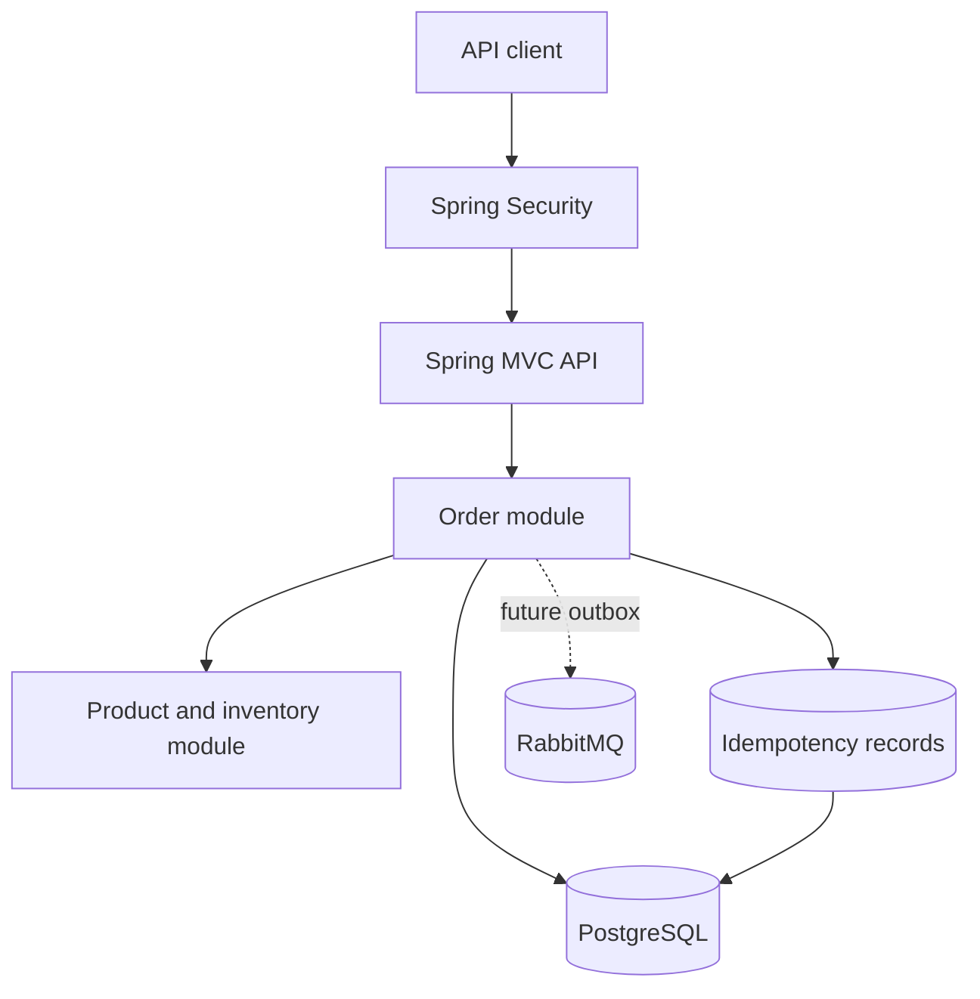

# Spring Boot Rescue Lab

[](https://github.com/tawsif113/spring-boot-rescue-lab/actions/workflows/ci.yml)

A production-incident laboratory for diagnosing, reproducing, and repairing common failures in Spring Boot services.

The application starts as a deliberately fragile order-management API. Each incident is handled as a professional case study: business impact, reproduction, evidence, root cause, remediation, regression tests, and measured results.

> **Important:** The incidents and data in this repository are simulations. The repository does not contain employer, client, or production source code.

## Current milestone

**Milestone 4 — INC-004 remediated**

The fragile baseline is preserved at [`baseline-fragile-v0.1.0`](https://github.com/tawsif113/spring-boot-rescue-lab/tree/baseline-fragile-v0.1.0). Four investigations are now complete:

- Order-list SQL is reduced from at least 42 statements for a 20-order page to exactly 3.
- Eight concurrent retries with the same idempotency key create one order and reserve stock once.
- Two buyers competing for the final unit now produce one order and one insufficient-stock rejection.
- Authenticated customer identities replace the spoofable ownership header.
- Customer queries enforce object ownership, while admin and metrics routes require `ROLE_ADMIN`.
- Persistent request fingerprints replay the original order and reject conflicting payloads.
- Every claim is backed by Testcontainers integration tests and CI-generated evidence.

The remaining baseline weaknesses are intentionally queued for later incidents:

- Reliable event publication has not yet been implemented.

These are controlled learning conditions, not recommended production patterns. Each completed investigation is linked in the [incident roadmap](#incident-roadmap), including the [INC-004 authorization report](incidents/INC-004-broken-authorization.md).

## Technology

- Java 25 by default
- Spring Boot 4.1.1
- Gradle 9.7.1 using the Groovy DSL
- PostgreSQL and Flyway
- Redis
- RabbitMQ
- Docker Compose
- JUnit 5 and Testcontainers
- Spring Boot Actuator and Prometheus metrics
- GitHub Actions

Spring Boot 4.1.1 supports Java 17 through Java 26. The default project target is Java 25; contributors temporarily limited to JDK 17 can run verification with `-PjavaVersion=17`.

## Architecture



The application is intentionally a modular monolith. That keeps each incident focused on the failure being investigated instead of hiding the lesson behind distributed-system boilerplate.

## Run locally

Prerequisites:

- JDK 25
- Docker with the Compose plugin

Start the infrastructure:

```bash
docker compose up -d
```

Run the application:

```bash
./gradlew bootRun
```

Check its health:

```bash
curl http://localhost:8080/actuator/health
```

RabbitMQ Management is available at <http://localhost:15672> with the local credentials `rescue_lab` / `rescue_lab`.

## Try the API

The local-only demo identities are:

| Username | Default password | Role |
|---|---|---|
| `alice` | `alice-change-me` | Customer |
| `bob` | `bob-change-me` | Customer |
| `admin` | `admin-change-me` | Administrator |

Override them with `ALICE_PASSWORD`, `BOB_PASSWORD`, and `ADMIN_PASSWORD`. Use TLS and an external OIDC/OAuth2 provider in production.

Create a product:

```bash
curl -i -X POST http://localhost:8080/api/admin/products \
  -u admin:admin-change-me \
  -H 'Content-Type: application/json' \
  -d '{
    "sku": "KEYBOARD-01",
    "name": "Mechanical Keyboard",
    "unitPrice": 80.00,
    "availableStock": 10
  }'
```

Copy the returned product ID and create an order:

```bash
curl -i -X POST http://localhost:8080/api/orders \
  -u alice:alice-change-me \
  -H 'Content-Type: application/json' \
  -H 'Idempotency-Key: checkout-attempt-001' \
  -d '{
    "items": [
      {
        "productId": "REPLACE_WITH_PRODUCT_ID",
        "quantity": 2
      }
    ]
  }'
```

List orders:

```bash
curl -u alice:alice-change-me 'http://localhost:8080/api/orders?page=0&size=20'
```

## Tests

Run the complete test suite:

```bash
./gradlew clean test
```

The PostgreSQL integration test uses Testcontainers and is skipped automatically if Docker is unavailable. Unit tests still run.

To verify the source on a machine that only has JDK 17:

```bash
./gradlew clean test -PjavaVersion=17
```

## Incident roadmap

| Incident | Failure | Primary lesson | Status |
|---|---|---|---|
| [INC-001](incidents/INC-001-slow-order-search.md) | Slow order search and N+1 queries | Evidence-driven performance tuning | Remediated |
| [INC-002](incidents/INC-002-duplicate-orders.md) | Duplicate orders after client retries | Idempotent API design | Remediated |
| [INC-003](incidents/INC-003-inventory-race.md) | Concurrent inventory overselling | Concurrency control | Remediated |
| [INC-004](incidents/INC-004-broken-authorization.md) | Cross-customer order access | Authentication and object ownership | Remediated |
| [INC-005](incidents/INC-005-lost-events.md) | Lost order events | Transactional outbox and delivery reliability | Planned |

See the complete delivery sequence in [`docs/ROADMAP.md`](docs/ROADMAP.md).

## Verification commands

```bash
./gradlew clean check
docker compose config
```

## License

Licensed under the MIT License.
