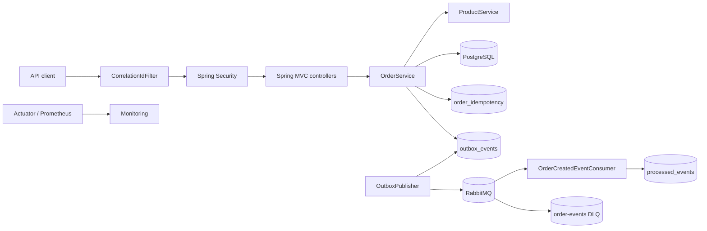
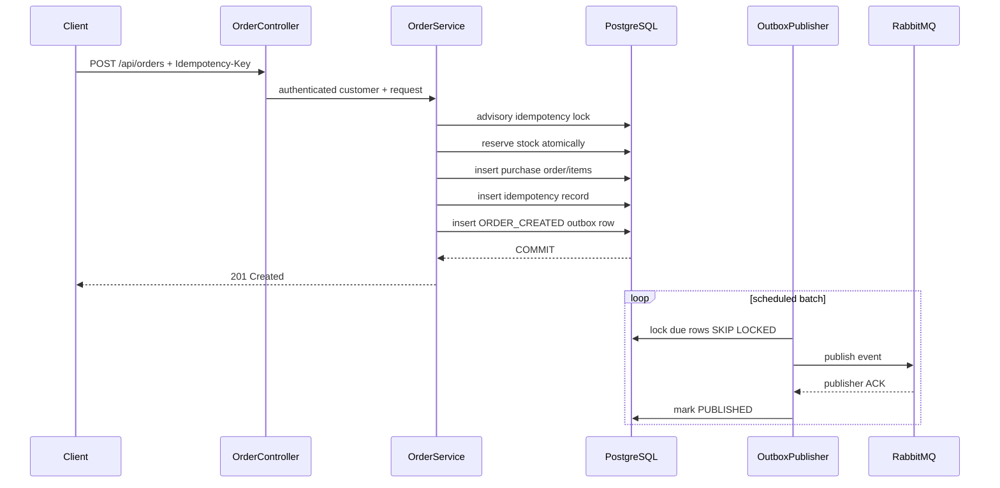

# Architecture

Spring Boot Rescue Lab is a deliberately small modular monolith used to demonstrate production debugging and remediation patterns without hiding the failure behind microservice boilerplate.

## Runtime view

## Order creation transaction

## Reliability model

The service does not claim exactly-once message delivery. It provides:

- atomic business-state + event-intent persistence in PostgreSQL;
- at-least-once RabbitMQ publication;
- publisher confirms;
- durable retry metadata with capped exponential backoff;
- stable event IDs;
- consumer deduplication;
- dead-letter quarantine.

This model is intentionally explicit about the crash window after broker acknowledgement and before the outbox status commit.

## Security boundary

The demo uses stateless HTTP Basic authentication only to keep the lab self-contained. Customer identity is derived from the authenticated principal, not a request header. Customer queries include the ownership predicate in PostgreSQL; administrative endpoints and Prometheus require `ROLE_ADMIN`.

A production system should replace the demo identity provider with OIDC/OAuth2 JWT validation while preserving the ownership predicates.

## Health model

- **Liveness:** process/Spring lifecycle only. External systems do not make the JVM "dead".
- **Readiness:** includes PostgreSQL because the service cannot safely accept an order without its transactional database.
- **RabbitMQ:** deliberately excluded from readiness. A broker outage creates an outbox backlog while order intake remains safe.

## Observability

Every HTTP request receives an `X-Correlation-Id`. Safe caller-provided IDs are preserved; otherwise a UUID is generated. The ID is placed in SLF4J MDC and therefore appears in Spring Boot ECS structured JSON logs.

Actuator exposes health and info publicly. Prometheus metrics remain administrator-only in this lab.
