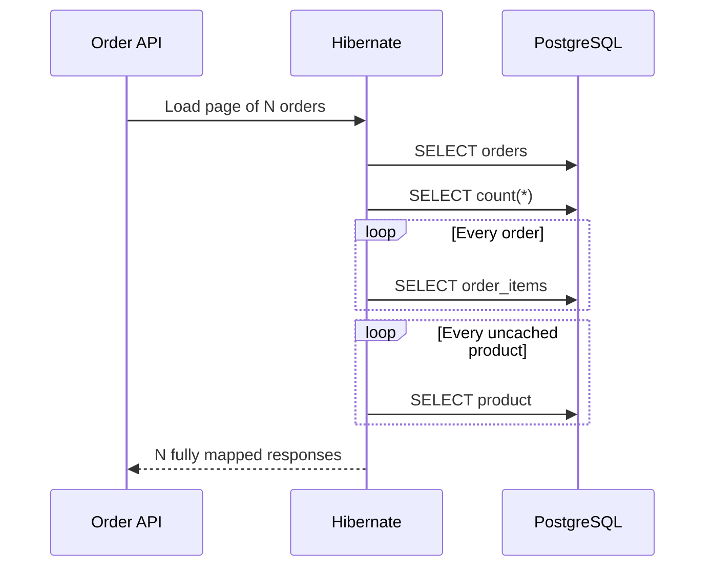
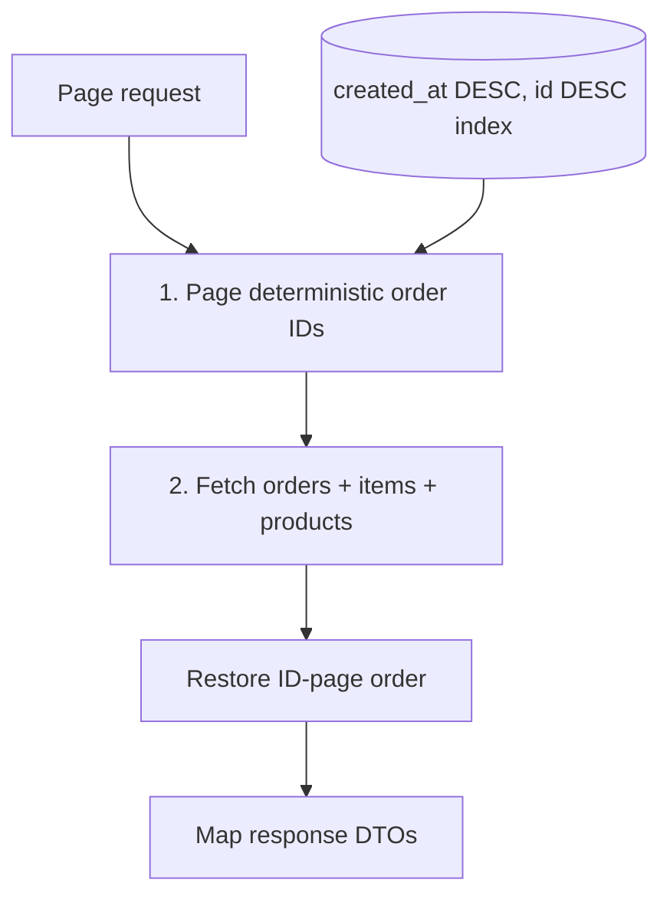

# INC-001 — Slow order search

**Status:** Remediated

**Severity:** SEV-2 simulation

**Affected endpoint:** `GET /api/orders?page={page}&size={size}`

**Baseline:** [`baseline-fragile-v0.1.0`](https://github.com/tawsif113/spring-boot-rescue-lab/tree/baseline-fragile-v0.1.0)

## Executive summary

The order-list endpoint issued more SQL every time the requested page grew. A page of 20 one-line orders required at least 42 prepared statements: two for pagination, one lazy collection query per order, and one lazy product query per line item. The database also lacked an index matching the newest-first sort.

The repair separates pagination from graph loading. Phase one retrieves a deterministic page of order IDs. Phase two fetches the selected orders, items, and products with an entity graph. The endpoint now uses exactly three prepared statements for every non-empty page, whether the page contains 1, 20, or 100 orders.

## Scenario

Support agents open the newest orders during a high-volume sales period. The first few requests appear healthy, but response time and database activity rise with the selected page size. Increasing the application replica count does not solve the problem; it multiplies the inefficient traffic sent to PostgreSQL.

### User-visible symptom

- Small pages appear acceptable during manual testing.
- Larger pages become progressively slower.
- Database CPU and active connections rise disproportionately to request volume.
- The endpoint remains functionally correct, which makes the defect easy to miss.

## Evidence and reproduction

The executable evidence is [`OrderSearchQueryCountIntegrationTest`](../src/test/java/com/tawsif/rescuelab/order/OrderSearchQueryCountIntegrationTest.java). It creates 20 orders with unique products, clears the persistence context, exercises both implementations, and reads Hibernate's prepared-statement counter.

| Read path | Page size | Prepared statements | Growth |
|---|---:|---:|---|
| Fragile baseline | 20 | At least 42 | `2 + orders + products` |
| Remediated | 20 | Exactly 3 | Constant for a non-empty page |

The CI test fails if the optimized path exceeds three statements. It also writes machine-readable evidence to `build/evidence/inc-001/query-count.json`, which GitHub Actions uploads as the `incident-evidence` artifact.

For latency and query-plan evidence, use the deterministic 10,000-order dataset and k6 scenario:

```bash
docker compose up -d
./gradlew bootRun

# In another terminal; requires psql and k6.
./performance/inc-001-run.sh
```

This generates:

- `build/evidence/inc-001/explain-plan.txt`
- `build/evidence/inc-001/k6-summary.json`
- p50, p90, p95, p99 and error-rate metrics from the same workload

Latency is environment-dependent, so this repository does not present one machine's timing as a universal result. The invariant evidence is the SQL count: page growth no longer creates query growth.

## What happened inside Hibernate

The original repository returned a page of `PurchaseOrder` entities. Both relationships needed by the API response were lazy. Mapping the response then traversed `order.items` and `item.product`, after the page query had completed.



For `N` one-line orders with unique products, the lower-bound statement count is:

\[
Q_{baseline}(N) = 2 + N + N = 2 + 2N
\]

The second performance defect was physical: `purchase_orders` had no index aligned with `ORDER BY created_at DESC`. PostgreSQL could scan and sort a growing table even before Hibernate began the lazy loads.

## Root cause

This was not one slow SQL statement. It was an object-relational access-pattern failure combined with a missing access-path index:

1. `Page<PurchaseOrder>` loaded only order rows.
2. DTO mapping accessed lazy collections after the page query.
3. Each collection caused an additional query.
4. Each uncached product proxy caused another query.
5. The newest-first page had no matching composite index.

`spring.jpa.open-in-view=false` helped expose the ownership of database access: all mapping happened inside the service transaction instead of leaking queries into JSON serialization.

## Options considered

| Option | Benefit | Rejected risk or cost |
|---|---|---|
| Make relationships eager | Small code change | Penalizes every order read and can create large accidental graphs |
| Fetch-join directly with `Pageable` | Appears to be one query | Collection fetch joins can duplicate rows and make database pagination unsafe |
| Hibernate batch fetching | Reduces query count | Hides rather than removes the access-pattern problem; count still depends on batch size |
| DTO projection | Excellent for fixed read models | More projection code; useful future option when the response diverges from the domain model |
| Two-phase ID page + graph fetch | Safe pagination, bounded SQL, clear intent | Requires reordering the second query's results in memory |

## Selected solution



The production path now performs:

1. One ID-page query ordered by `createdAt DESC, id DESC`.
2. One count query for page metadata.
3. One entity-graph query for the selected aggregate data.
4. In-memory reordering based on the ID page, because SQL `IN` does not preserve order.

Migration `V2__optimize_order_search.sql` adds the composite index that matches the deterministic sort. The UUID tie-breaker prevents unstable ordering when several orders share a timestamp.

## Regression controls

- Query-count integration test: optimized non-empty page must use exactly three statements.
- Functional assertions: both paths must return the requested page size.
- Flyway migration: the supporting index is versioned and reviewable.
- k6 thresholds: error rate below 1% and p95 below 250 ms on the documented local dataset.
- CI artifact: query-count JSON is retained with the workflow run.

## Production follow-ups

- Alert on endpoint p95/p99 latency and database call count per trace.
- Track returned page size so performance changes can be normalized.
- Re-run `EXPLAIN (ANALYZE, BUFFERS)` after meaningful table-growth milestones.
- Consider cursor pagination when deep offset pages become a real access pattern.
- Replace the entity graph with a dedicated projection if the public response stops matching the aggregate shape.

## Interview-ready explanation

> The endpoint had a query-amplification problem, not merely a slow query. I proved the N+1 behavior using Hibernate statistics, preserved safe database pagination by paging IDs first, fetched the required graph in a second query, restored deterministic ordering, and added a composite PostgreSQL index. The regression test reduces the result from at least 42 statements for 20 orders to exactly three.
