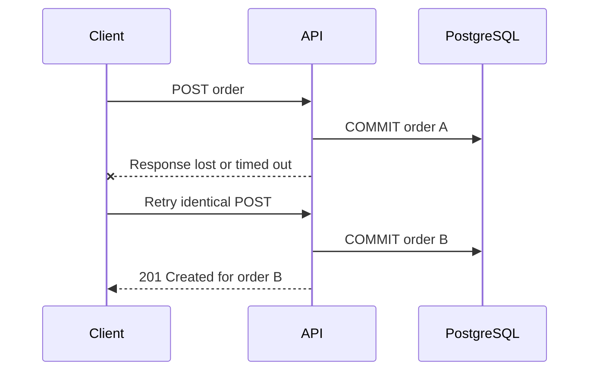
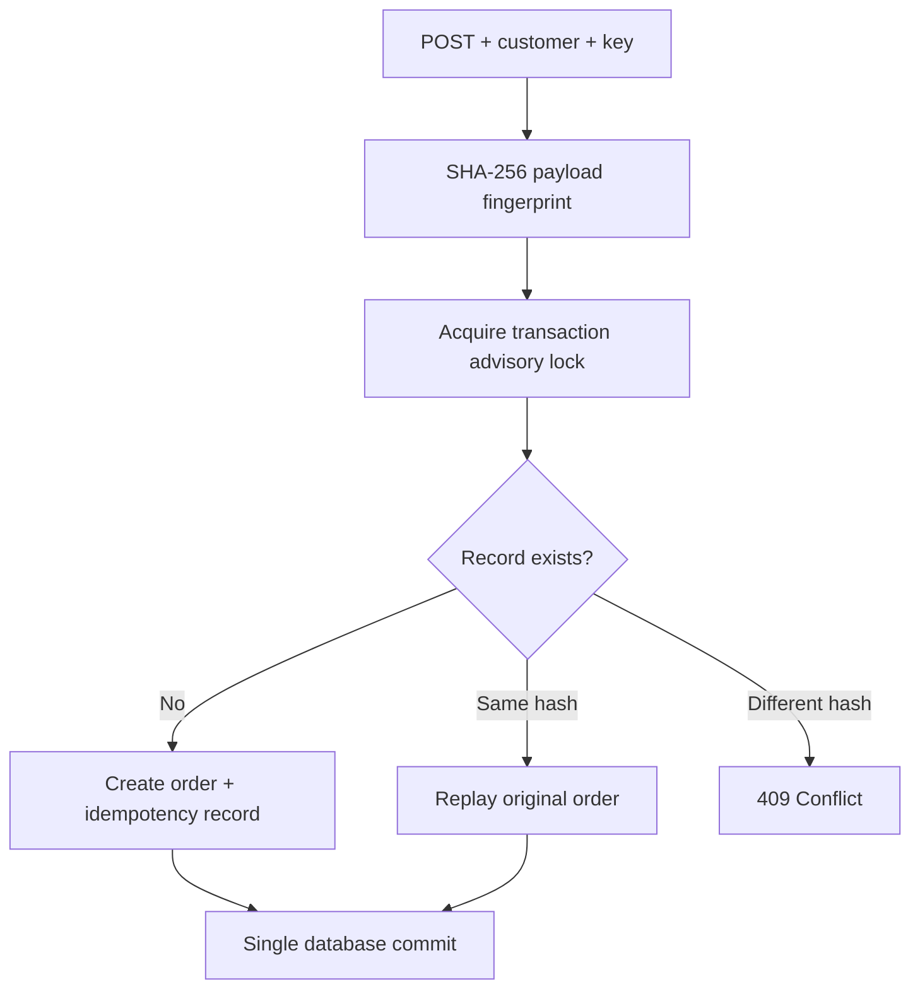

# INC-002 — Duplicate orders after retries

**Status:** Remediated

**Severity:** SEV-1 simulation

**Affected endpoint:** `POST /api/orders`

## Executive summary

A mobile client submitted an order, timed out before receiving the response, and retried. The baseline interpreted every POST as a new command, so a successful-but-unobserved request could create a second order and reserve stock twice.

The API now requires an `Idempotency-Key` scoped to the customer. PostgreSQL serializes concurrent attempts for that key with a transaction-scoped advisory lock. A durable record binds the key to a SHA-256 request fingerprint and the committed order. Same-key/same-payload retries replay the original order; same-key/different-payload requests return `409 Conflict`.

## Scenario

Nothing in HTTP tells the server whether the second request is a retry or a deliberate second purchase. The client needs a stable command identity, and the server must remember the result atomically.

## Business impact

- Customers can be charged or fulfilled twice.
- Inventory is reserved more than once.
- Support must determine which order is legitimate.
- Blind client retries become unsafe precisely when the network is least reliable.

## Reproduction and evidence

[`OrderIdempotencyIntegrationTest`](../src/test/java/com/tawsif/rescuelab/order/OrderIdempotencyIntegrationTest.java) launches eight Java 25 virtual threads behind a start gate. Every thread submits the same customer, key, and payload concurrently.

The acceptance criteria are executable:

| Measurement | Required result |
|---|---:|
| Concurrent requests | 8 |
| Orders created | 1 |
| Stock reservations | 1 |
| Unique response order IDs | 1 |
| Replayed responses | 7 |
| Idempotency records | 1 |

The test writes `build/evidence/inc-002/concurrent-retries.json`, uploaded by CI as part of the `incident-evidence` artifact. A second test proves that reusing the key with a changed quantity returns a conflict without changing stock or creating another order.

## Idempotency contract

| Rule | Behavior |
|---|---|
| Header | `Idempotency-Key` is required, trimmed, non-blank, and at most 128 characters |
| Scope | A key is unique per customer, not globally |
| Same key + same payload | Return the original order with `Idempotency-Replayed: true` |
| Same key + different payload | Return `409 Conflict` |
| First successful request | Return `201 Created` with `Idempotency-Replayed: false` |
| Failed transaction | Persist neither the order nor the key, allowing a safe retry |
| Retention | 24 hours by default; configurable with `IDEMPOTENCY_TTL` |
| Expired key | Deleted under the same lock and may be reused |

The fingerprint is SHA-256 over the ordered logical line-item sequence (`productId:quantity`). It deliberately excludes transport details such as JSON whitespace and header order.

## Root cause

The original API treated resource creation as an at-most-once client concern, but networks only give the client ambiguous outcomes. A timeout means “unknown,” not “failed.” Without a durable command identity, the server cannot distinguish a replay from a new purchase.

An in-memory cache would not solve this:

- it disappears on restart;
- it is not shared across application replicas;
- it cannot commit atomically with the order;
- eviction can silently re-enable duplicates.

## Selected solution

The database transaction is the consistency boundary:

1. Hash the validated request.
2. Acquire `pg_advisory_xact_lock(hashtextextended(customer:key))`.
3. Read the durable idempotency record and its complete order graph.
4. Replay, reject, or create.
5. Commit the order and idempotency record together.
6. Let PostgreSQL release the lock automatically on commit or rollback.

The unique constraint on `(customer_id, idempotency_key)` remains a defense-in-depth invariant. The advisory lock prevents the unique-constraint race from poisoning a transaction and makes concurrent callers wait for the original result.

## Why PostgreSQL instead of Redis

| Design | Advantage | Trade-off |
|---|---|---|
| Redis `SET NX` | Fast and naturally expiring | Requires a second consistency system; crash windows exist between Redis and PostgreSQL |
| Unique row only | Simple schema | The losing insert marks its transaction rollback-only and still needs replay coordination |
| PostgreSQL advisory lock + row | Atomic with the order; replica-safe; no distributed transaction | PostgreSQL-specific and holds a short database connection while the command runs |

For this modular monolith, correctness and one transactional boundary outweigh the small lock cost. The lock scope is a single customer/key pair, so unrelated orders proceed concurrently.

## Expiry and cleanup

Records expire after `PT24H` by default. Expired records are:

- removed lazily if that key is used again; and
- deleted hourly by `IdempotencyCleanupJob` using the indexed `expires_at` column.

The linked order is never deleted by cleanup. Only the replay metadata expires.

## Regression controls

- Eight-way concurrent retry integration test using virtual threads.
- Payload-mismatch conflict test.
- Unit tests for deterministic and payload-sensitive fingerprints.
- Database uniqueness constraint and foreign key.
- Configurable expiry plus scheduled cleanup.
- Replay indicator header for logs, clients, and dashboards.

## Operational signals

Recommended production metrics:

- idempotency replays per endpoint;
- payload-conflict count;
- advisory-lock wait time;
- expired records removed per cleanup run;
- order creation latency split by original versus replay.

A sudden increase in replays often indicates client timeouts or a downstream latency regression rather than abusive clients.

## Interview-ready explanation

> A timeout creates an ambiguous outcome, so retry safety must be designed server-side. I scoped an idempotency key by customer, fingerprinted the logical payload, serialized concurrent same-key commands with a PostgreSQL transaction lock, and committed the key record with the order. Eight concurrent retries now return one order ID, reserve stock once, and produce seven replayed responses.
