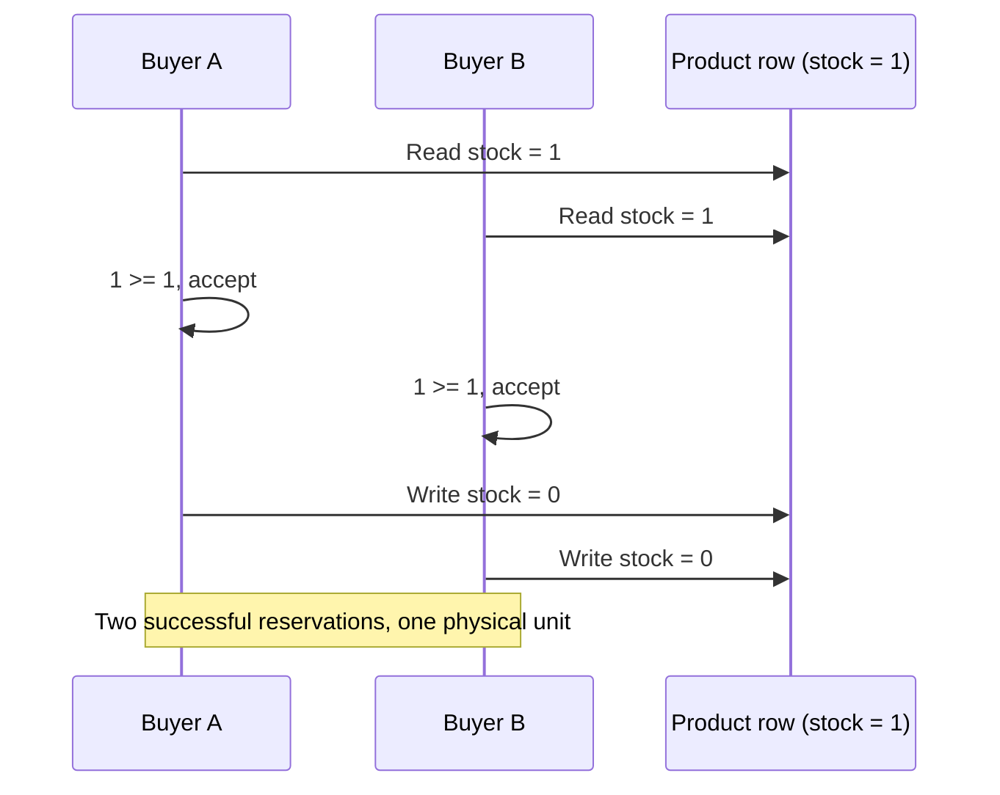
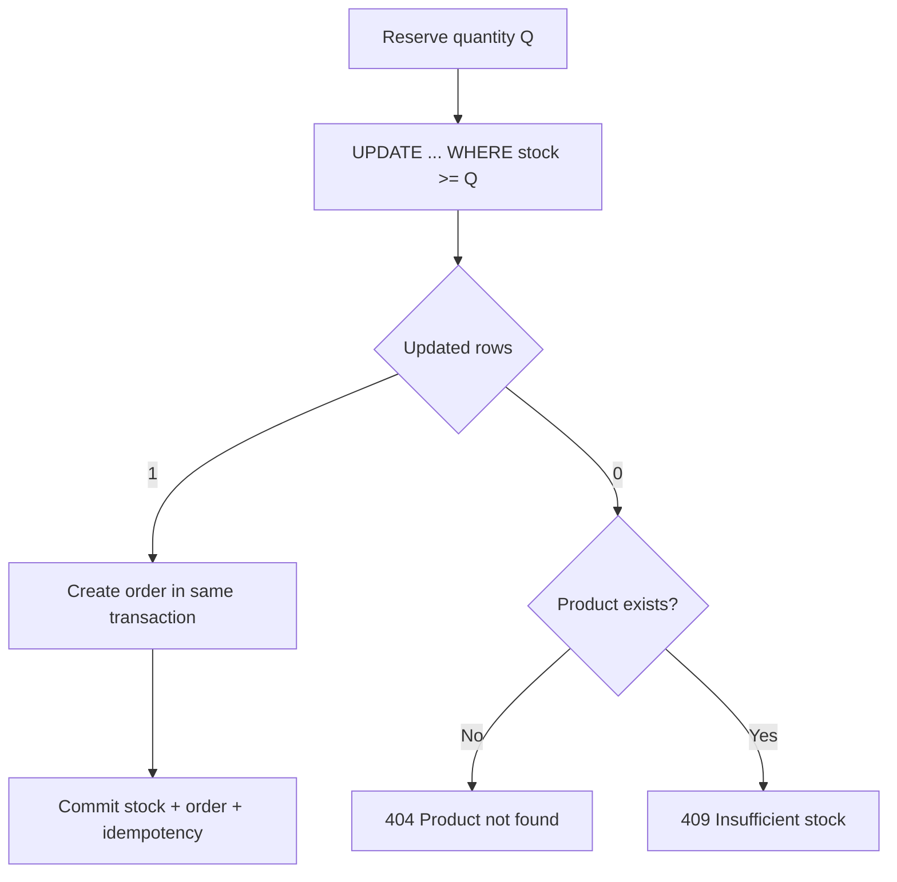

# INC-003 — Inventory overselling under concurrency

**Status:** Remediated

**Severity:** SEV-1 simulation

**Affected operation:** Stock reservation during `POST /api/orders`

## Executive summary

Two buyers attempted to purchase the last unit of a product. The baseline loaded the same stock value into two transactions, validated it in Java, and later wrote the same decremented value twice. Both commands reported success even though only one unit existed. The final database value was zero, which looked valid and concealed the oversell.

The repair moves the invariant into one atomic PostgreSQL statement:

```sql
UPDATE products
SET available_stock = available_stock - :quantity,
    updated_at = :updatedAt
WHERE id = :productId
  AND available_stock >= :quantity;
```

An update count of one means the reservation succeeded. Zero means the product is missing or no longer has enough stock. The update participates in the order transaction, so any later failure rolls it back.

## Scenario



This is a lost update. A non-negative database value does not prove that every accepted reservation was valid.

## Deterministic reproduction

[`InventoryConcurrencyIntegrationTest`](../src/test/java/com/tawsif/rescuelab/order/InventoryConcurrencyIntegrationTest.java) contains two races:

1. **Fragile path:** two independent transactions load the same product, wait at a `CyclicBarrier`, call the original read-check-write domain method, and commit.
2. **Protected path:** two Java 25 virtual threads submit distinct orders and idempotency keys for a separate product with one unit.

| Measurement | Fragile path | Protected path |
|---|---:|---:|
| Initial stock | 1 | 1 |
| Concurrent buyers | 2 | 2 |
| Successful reservations | 2 | 1 |
| Rejected reservations | 0 | 1 |
| Final stock | 0 | 0 |
| Orders created | Not part of harness | 1 |

The surprising evidence is the fragile final stock: it is **zero, not negative**. Both transactions wrote the same value, so a simple `available_stock >= 0` constraint could not detect the business violation.

The CI test generates `build/evidence/inc-003/inventory-race.json` and uploads it in the `incident-evidence` artifact.

## Root cause

The invariant was split across three operations:

1. Read the product row.
2. Check stock in application memory.
3. Write the new stock at transaction flush.

PostgreSQL's default `READ COMMITTED` isolation allows both transactions to read the same committed version before either write occurs. Hibernate had no `@Version` column, and the SELECT acquired no write lock. The later updates therefore overwrote each other without an error.

## Options considered

| Strategy | Behavior | Best fit | Trade-off |
|---|---|---|---|
| Serializable isolation | Database detects unsafe schedules | Broad, rare critical workflows | More aborts and transaction-wide retry complexity |
| Pessimistic row lock | `SELECT ... FOR UPDATE` serializes access | Long decisions requiring stable row state | Holds locks while application logic runs |
| Optimistic `@Version` | Loser receives an optimistic-lock failure | Low-contention aggregates with safe retries | Requires retry policy and a schema version column |
| Atomic conditional update | Check and decrement in one statement | Numeric inventory counters | Bypasses entity mutation and is database-oriented |

## Selected solution

Atomic conditional update is the smallest consistency boundary for this invariant.



Why it works:

- PostgreSQL locks the row while evaluating and applying the update.
- A waiting transaction re-checks the predicate against the newest row version.
- Stock never becomes negative.
- Exactly one contender can change `1` to `0`.
- The reservation rolls back if order persistence or idempotency persistence fails.

## Interaction with INC-002

Idempotency and inventory concurrency solve different problems:

- Same customer + same key retries are serialized and replayed by INC-002.
- Different customers or different keys competing for stock are protected by INC-003.

Using different keys must not bypass inventory correctness, and using the same key must not reserve twice. The integration suite covers both dimensions.

## Regression controls

- Barrier-controlled lost-update reproduction.
- Two-buyer/one-unit protected race using distinct keys.
- Database `CHECK (available_stock >= 0)` remains defense in depth.
- Reservation method requires an existing order transaction (`Propagation.MANDATORY`).
- Failure returns the live database stock in the conflict message.
- Stock, order, and idempotency record commit or roll back together.

## Operational signals

- successful reservation count;
- insufficient-stock rejection count;
- atomic-update latency and row-lock wait time;
- rollback count after a successful reservation;
- high-contention products by SKU.

Contention is business information: repeated rejections for one SKU may indicate a flash sale, stale cache, bot activity, or inventory synchronization lag.

## Interview-ready explanation

> The race was a lost update, so the final stock remained zero even though two buyers were accepted for one unit. I reproduced the exact interleaving with two transactions and a barrier, compared optimistic, pessimistic, serializable, and atomic approaches, then moved the invariant into a conditional SQL update. In the regression race, one order commits and the other receives insufficient stock.
