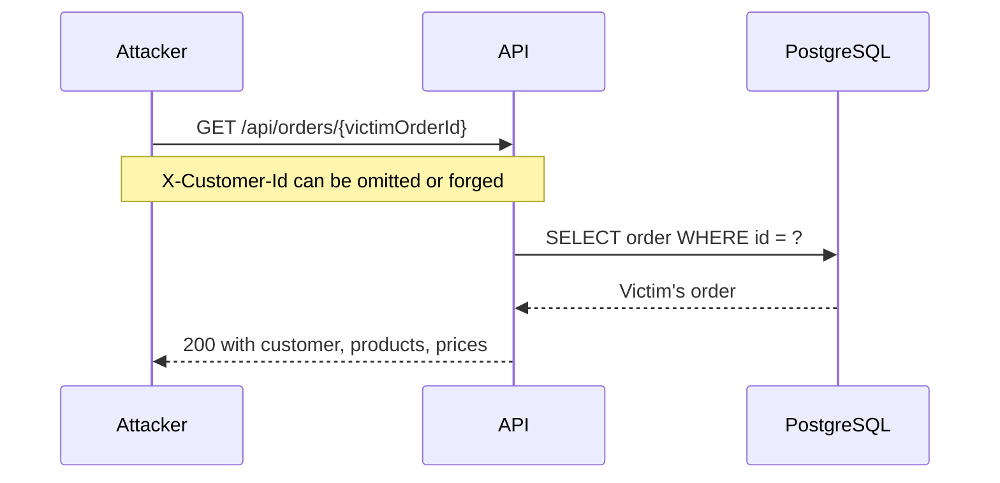
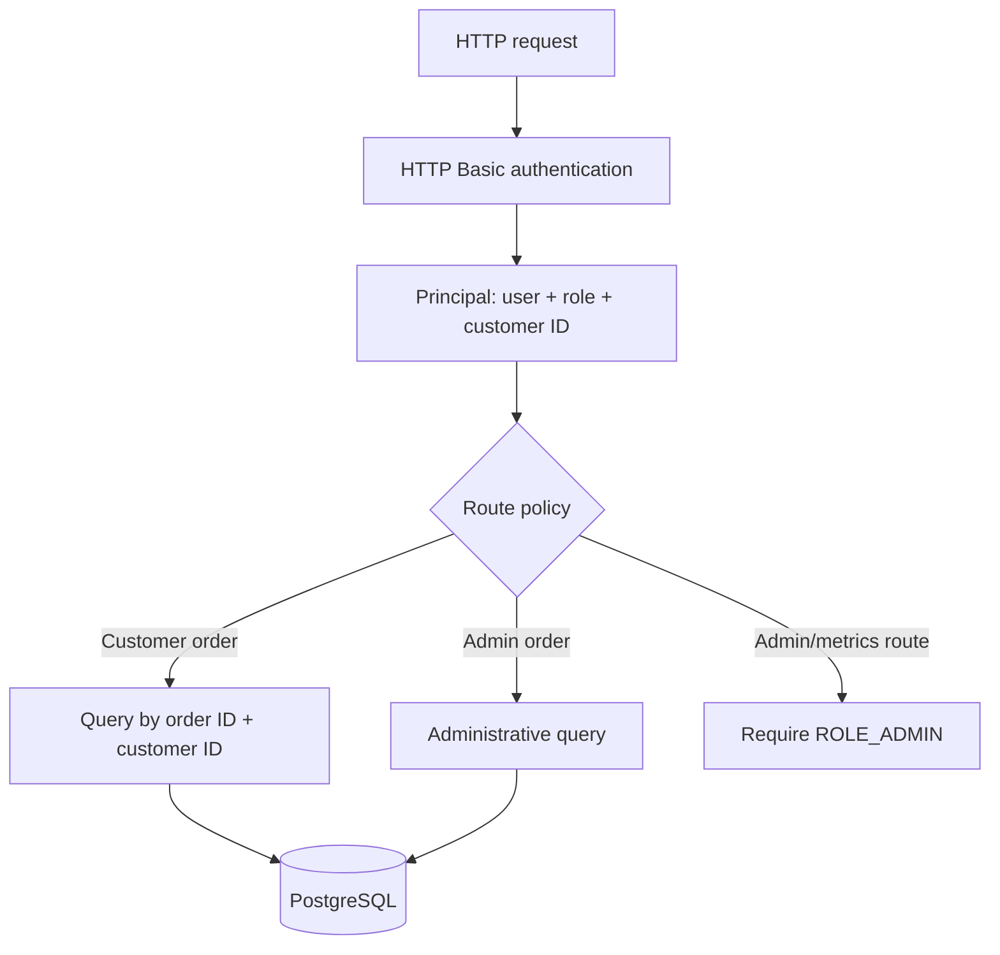

# INC-004 — Broken object-level authorization

**Status:** Remediated

**Severity:** SEV-1 simulation

**Affected surface:** Order APIs, product administration, and Actuator

## Executive summary

The baseline trusted an `X-Customer-Id` request header and allowed every route. Any caller could claim another customer's identity, retrieve arbitrary orders by UUID, list all customers' orders, create products, and read detailed operational endpoints.

The repair makes Spring Security's authenticated principal the sole identity source. Customer reads include `customer_id` in the repository predicate, administrative routes require `ROLE_ADMIN`, sessions are stateless, and detailed operational metrics are protected. Cross-customer order lookups return `404 Not Found`, avoiding an order-existence oracle.

## Attack scenario



The UUID is not authorization. IDs leak through logs, screenshots, browser history, support conversations, analytics, and dependent systems.

## Reproduction and evidence

[`OrderAuthorizationIntegrationTest`](../src/test/java/com/tawsif/rescuelab/order/OrderAuthorizationIntegrationTest.java) executes the complete authorization matrix through Spring MVC and the real security filter chain.

| Request | Expected status | Security property |
|---|---:|---|
| Anonymous reads an order | 401 | Authentication required |
| Bob reads Alice's order | 404 | Ownership enforced without existence disclosure |
| Alice reads Alice's order | 200 | Owner allowed |
| Admin reads Bob's order | 200 | Administrative visibility |
| Customer creates a product | 403 | Role boundary enforced |
| Admin creates a product | 201 | Administrative action allowed |
| Alice sends Bob's old header while creating | 201 owned by Alice | Header spoofing is irrelevant |
| Anonymous reads Prometheus | 401 | Metrics protected |
| Customer reads Prometheus | 403 | Operational role required |
| Admin reads Prometheus | 200 | Authorized operations access |

The test writes `build/evidence/inc-004/authorization-matrix.json`, uploaded by GitHub Actions.

## Root cause

Authentication and authorization were both absent:

1. The application accepted a caller-controlled customer identifier.
2. Repository reads filtered only by order ID.
3. List operations had no tenant/customer predicate.
4. Administrative and customer APIs shared the same permissive filter chain.
5. Actuator exposed health details and Prometheus without a role boundary.

Controller-only ownership checks would still be fragile. A future endpoint could call the unrestricted repository method and accidentally reintroduce the vulnerability.

## Selected design



### Defense layers

1. **Authentication:** Spring Security verifies credentials and creates `RescueUserPrincipal`.
2. **Route authorization:** customer creation, administrative APIs, and metrics have explicit roles.
3. **Object ownership:** customer order lookup uses `findByIdAndCustomerId`.
4. **Collection isolation:** customer pagination includes `customer_id` in both ID and graph-fetch queries.
5. **Database access path:** `(customer_id, created_at DESC, id DESC)` supports scoped listing.
6. **Information minimization:** cross-customer and missing order IDs both produce 404.

## Authentication choice

The laboratory uses stateless HTTP Basic authentication so the security behavior can run locally without an external identity provider. Passwords are encoded with Spring Security's delegating encoder and supplied through environment variables.

| Demo principal | Role | Customer identity |
|---|---|---|
| `alice` | `CUSTOMER` | `11111111-1111-1111-1111-111111111111` |
| `bob` | `CUSTOMER` | `22222222-2222-2222-2222-222222222222` |
| `admin` | `ADMIN` | None |

Default passwords are development-only and documented in the README. A production deployment must use TLS and replace the in-memory provider with an OIDC/OAuth2 identity provider. The important design boundary survives that replacement: controllers consume a trusted principal, never a caller-supplied ownership header.

## Why ownership lives in queries

The insecure pattern is:

```text
load order by ID -> compare customer in application code
```

The selected pattern is:

```text
load order where ID = ? and customer_id = ?
```

The latter returns no unauthorized entity to application memory, avoids accidental serialization, and produces the same result for missing and forbidden identifiers.

## Actuator hardening

- `/actuator/health`, liveness, readiness, and `/actuator/info` remain public.
- Health component details are visible only to administrators.
- `/actuator/prometheus` requires `ROLE_ADMIN`.
- Every unlisted route is denied by default.

In a production cluster, network policy should provide another layer around management endpoints.

## Regression controls

- Real filter-chain integration tests with Basic credentials.
- Cross-customer object test and customer-scoped list test.
- Spoofed legacy-header test.
- Customer/admin role-boundary tests.
- Public-health/protected-metrics tests.
- Ownership composite index managed by Flyway.
- Deny-by-default final authorization rule.

## Interview-ready explanation

> The vulnerability was BOLA: the API trusted a customer header and treated a UUID as authorization. I removed the header as an identity source, derived customer identity from the authenticated principal, pushed ownership into repository predicates, returned 404 for cross-customer IDs, separated customer and admin routes, and tested the full 401/403/404/200 matrix through the real Spring Security chain.
