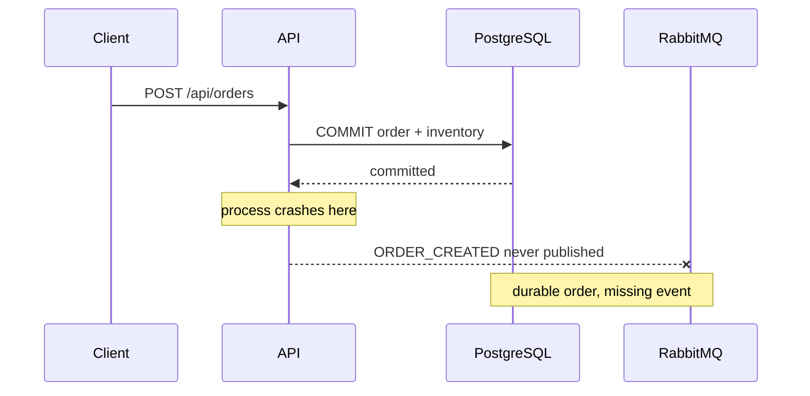
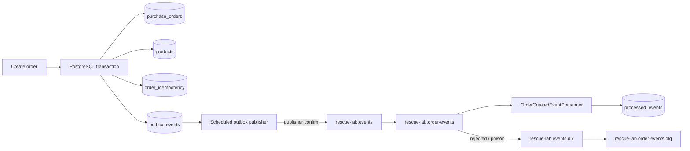

# INC-005 — Lost order events

**Status:** Remediated

**Severity:** SEV-1 simulation

**Affected surface:** Order persistence, RabbitMQ integration events, downstream consumers

## Executive summary

The fragile baseline had no reliable integration-event publication. Writing an order to PostgreSQL and publishing an `ORDER_CREATED` message to RabbitMQ are two independent side effects. If the process commits the database transaction and fails before the broker accepts the message, the order exists permanently but downstream systems never learn about it.

The remediation uses a **transactional outbox**. Order state, idempotency state, inventory updates, and the outbox event are committed in the same PostgreSQL transaction. A scheduled publisher later locks due outbox rows, publishes them with RabbitMQ publisher confirms, and marks them published only after acknowledgement. Failed publications remain pending with retry metadata and exponential backoff.

Delivery is therefore **at least once**, not exactly once. A crash after RabbitMQ accepts a message but before PostgreSQL records `PUBLISHED` can cause redelivery. The consumer handles that correctly by recording each event ID in `processed_events` with `ON CONFLICT DO NOTHING`; duplicate deliveries become no-ops.

## Failure window in the baseline



A database transaction cannot atomically commit a RabbitMQ message. Retrying direct publication after the HTTP request does not close the failure window because the application can still stop between the two systems.

## Root cause

The missing guarantee was not "RabbitMQ retry". The missing guarantee was a durable handoff boundary between the database transaction and the message broker.

The system needed to answer two separate questions:

1. **Was the event durably recorded with the business transaction?**
2. **Can publication be retried without corrupting downstream state?**

The transactional outbox answers the first. Consumer idempotency answers the second.

## Selected design



### Producer transaction

`OrderService.create` now performs the following work in one transaction:

- acquire the customer-scoped idempotency lock;
- reserve inventory;
- persist the order;
- persist the idempotency record;
- persist an `ORDER_CREATED` outbox event.

If that transaction rolls back, all five effects roll back together.

### Publisher semantics

The publisher selects due `PENDING` rows using:

```sql
FOR UPDATE SKIP LOCKED
```

This lets multiple application instances poll the same table without processing the same row concurrently.

For each selected event:

1. publish to the durable exchange;
2. attach the outbox UUID as RabbitMQ message ID;
3. wait for a correlated publisher confirm;
4. mark the row `PUBLISHED` only after an ACK;
5. on failure, leave it `PENDING`, increment `attempts`, record the error, and schedule a later retry.

The retry delay grows exponentially and is capped, avoiding a hot loop during a broker outage.

## Why duplicates are still possible

Publisher confirms remove the "fire and forget" ambiguity, but no two-system protocol here can make the PostgreSQL status update and RabbitMQ acceptance one atomic operation.

A crash can still occur after the broker ACK but before the transaction that sets `PUBLISHED` commits. The same outbox row will be retried. That is expected behavior for an at-least-once design.

The consumer therefore performs an atomic insert:

```sql
INSERT INTO processed_events (...)
VALUES (...)
ON CONFLICT (event_id) DO NOTHING;
```

Only the first delivery is accepted. In a real downstream service, its business-side effect should be committed in the same local transaction as that deduplication insert.

## Dead-letter handling

The normal queue is configured with a dead-letter exchange and dead-letter routing key. Listener requeue-on-rejection is disabled. Malformed messages are rejected without requeue and are routed to the durable DLQ rather than circulating forever.

The DLQ is an operational quarantine, not an automatic recovery mechanism. Production handling should alert on non-zero DLQ depth and require inspection/replay tooling.

## Failure-injection evidence

`OutboxReliabilityIntegrationTest` uses PostgreSQL Testcontainers and proves three properties:

| Failure injection | Expected result |
|---|---|
| Throw after order creation inside the surrounding transaction | New order, inventory change, idempotency row, and outbox row all roll back |
| Simulated RabbitMQ outage during publication | Event remains `PENDING`; attempt/error/next-attempt metadata is persisted |
| Deliver the same event ID twice | One `processed_events` row is created |

The test writes `build/evidence/inc-005/outbox-reliability.json`, which GitHub Actions uploads with the other incident evidence.

## Operational behavior

- PostgreSQL is part of readiness because order intake cannot safely operate without its transactional state.
- RabbitMQ is intentionally **not** part of readiness. A broker outage should increase outbox backlog while the API continues accepting safe orders.
- Publisher retry metadata makes the backlog inspectable.
- The dead-letter queue isolates messages that cannot be consumed.
- Correlation IDs and structured JSON logs make request and event investigations easier.

## Alternatives considered

| Option | Why it was not selected |
|---|---|
| Publish directly before DB commit | A DB rollback can leave a message for an order that does not exist |
| Publish directly after DB commit | A crash can leave a committed order with no event |
| XA / distributed transaction | Heavy operational coupling and poor fit for RabbitMQ + PostgreSQL in this lab |
| In-memory retry queue | Process loss also loses the retry state |
| Transactional outbox | Selected: durable, observable, simple failure model |

## Trade-offs

The outbox introduces extra writes, polling traffic, table-retention work, and eventual rather than immediate publication. It also requires consumers to treat duplicate delivery as normal.

Those costs buy a clear guarantee: **a committed order cannot lose the durable intent to publish its integration event**.

## Interview-ready explanation

> I did not try to make PostgreSQL and RabbitMQ behave like one transaction. I persisted the integration event in an outbox row inside the order transaction, then published asynchronously with broker confirms and retry metadata. Because a crash after broker ACK can still duplicate delivery, the consumer deduplicates by event ID. That gives at-least-once delivery with no lost committed event intent, plus an explicit DLQ for poison messages.
