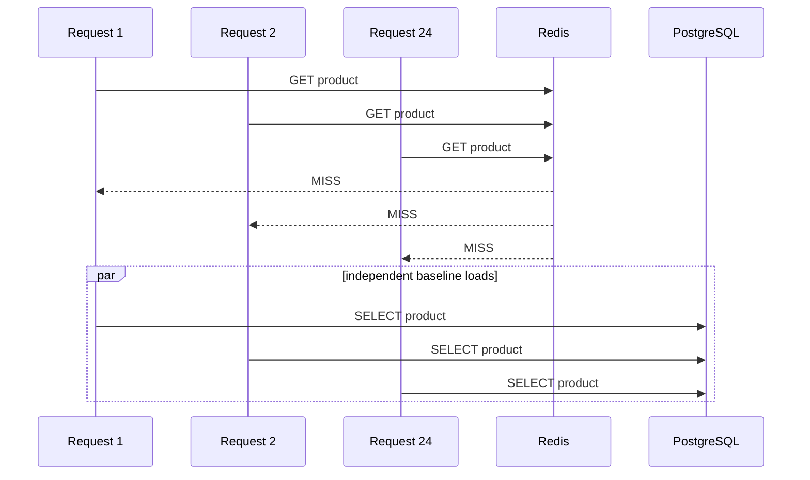
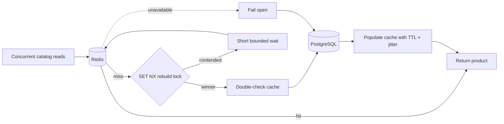

# INC-006 — Hot product cache stampede

**Status:** Remediated

**Severity:** SEV-2 simulation

**Affected surface:** Public product catalog, PostgreSQL read capacity, Redis cache

## Executive summary

A hot product page can turn a cache expiry into a database traffic spike. In the baseline read path, every request that misses cache independently loads the same product from PostgreSQL. When a popular key expires, dozens or hundreds of requests can arrive before the first one finishes rebuilding the cache, multiplying database work exactly when the system is already under load.

The remediation adds a Redis-backed read-through catalog cache with **distributed single-flight** behavior:

- one request acquires a short-lived Redis rebuild lock;
- the lock holder double-checks the cache, loads PostgreSQL once, and repopulates Redis;
- concurrent requests wait briefly for that value instead of querying PostgreSQL themselves;
- TTL jitter prevents many hot keys from expiring at the same instant;
- inventory writes invalidate the product cache only **after the PostgreSQL transaction commits**;
- Redis is treated as an optimization, not a source of truth: if it is unavailable, catalog reads fail open to PostgreSQL.

The deterministic integration test launches 24 simultaneous cold reads. The baseline path performs **24 PostgreSQL loads**. The rescued path performs **exactly 1**.

## Failure scenario



The cache reduces steady-state traffic, but a naive cache-aside implementation still allows a synchronized miss burst. The result can be connection-pool saturation, increased query latency, and cascading request timeouts.

## Root cause

The problem is not merely "the cache expired." The problem is that a cache miss had no coordination boundary.

Every request performed the same expensive recovery action:

```text
cache miss -> database load -> cache write
```

With N concurrent requests, that creates up to N identical database loads.

## Selected design



### Distributed single-flight

The rebuild lock is a Redis key acquired with `SET NX` plus a TTL. Because the lock lives in Redis, it coordinates multiple application instances rather than only threads inside one JVM.

The lock holder performs a **second cache lookup after acquiring the lock**. That closes the race where another node filled the cache between the initial miss and lock acquisition.

The lock is released with a compare-and-delete Lua script. A process only deletes the lock if the stored token is still its own, preventing one request from deleting a lock that expired and was subsequently acquired by another node.

### Bounded waiting

Requests that lose the rebuild race do not spin indefinitely. They poll Redis for a configurable bounded period.

If the rebuilding request cannot produce the value before the wait deadline, the waiting request falls back to PostgreSQL. This deliberately favors availability over absolute database-load minimization.

## TTL jitter

A fixed TTL can synchronize expiration across many popular keys. INC-006 adds a random positive jitter to each cache write:

```text
effective TTL = base TTL + random(0..jitter)
```

This spreads rebuild work across time and reduces correlated expiry spikes.

## Transaction-safe invalidation

Product stock changes inside the order transaction. Evicting Redis before PostgreSQL commits creates a subtle race:

1. transaction updates stock but has not committed;
2. cache is evicted immediately;
3. another request misses Redis and reads the old committed database value;
4. that old value is cached;
5. the original transaction commits.

The cache would now contain stale stock.

The repair registers cache eviction through Spring transaction synchronization and executes it in `afterCommit`. If the transaction rolls back, the existing cache entry remains valid. If it commits, the next catalog read reloads the new stock.

## Redis outage behavior

Redis is not authoritative product storage. A Redis outage must therefore degrade performance, not correctness or availability.

Cache reads, lock operations, writes, unlocks, and invalidation catch Redis data-access failures, increment a failure metric, and continue against PostgreSQL where necessary.

This is why Redis remains excluded from the service's readiness boundary.

## Evidence

`ProductCatalogCacheIntegrationTest` starts real PostgreSQL and Redis containers and introduces a controlled 150 ms database-read delay to widen the cold-miss race.

| Scenario | Concurrent readers | PostgreSQL loads |
|---|---:|---:|
| Baseline direct read path | 24 | **24** |
| Redis single-flight path | 24 | **1** |

The same integration test also warms a product with stock 10, commits a reservation of 3 units, and verifies the next catalog read returns stock 7 rather than stale cached data.

`ProductCatalogServiceTest` simulates Redis being unavailable and proves the read still succeeds from the database source.

Generated evidence is written to `build/evidence/inc-006/cache-stampede.json` and uploaded by GitHub Actions.

## Metrics

The remediation publishes:

- `rescue.catalog.db.loads`
- `rescue.catalog.cache.hits`
- `rescue.catalog.cache.misses`
- `rescue.catalog.cache.lock.contention`
- `rescue.catalog.cache.wait.timeouts`
- `rescue.catalog.cache.redis.failures`

These distinguish normal cache behavior from a rebuilding storm or degraded Redis dependency.

## Alternatives considered

| Option | Limitation |
|---|---|
| Plain cache-aside | Does not collapse concurrent misses |
| JVM-local synchronized block | Works only inside one application instance |
| Very long TTL | Reduces misses but increases staleness and does not solve invalidation |
| Redis distributed lock + bounded waiting | **Selected:** cross-instance coordination with explicit availability trade-off |
| Serve stale values indefinitely | Useful in some domains, but stock visibility in this lab should refresh after committed writes |

## Trade-offs

The lock introduces Redis coordination traffic and a bounded wait on cold misses. A lock holder can also disappear, so the lock must have a TTL.

The design does **not** promise that PostgreSQL will never receive duplicate fallback loads. If rebuilding exceeds the bounded wait window, waiting requests are allowed to fail open. The guarantee is practical stampede suppression under normal rebuild latency, not distributed exactly-once cache loading.

## Interview-ready explanation

> A naive Redis cache still lets every request hit PostgreSQL when a hot key expires. I reproduced that with 24 simultaneous cold reads, then added a Redis SET-NX rebuild lock, double-checking, bounded waiting, TTL jitter, and token-safe Lua unlock. The rescued path reduced 24 PostgreSQL loads to one. I also made cache invalidation happen after transaction commit and made Redis fail open, so losing the cache degrades performance rather than correctness.
